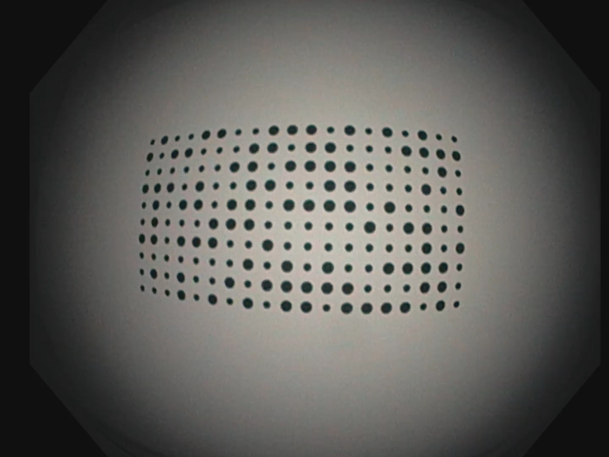

# EM Dataset: Photometric calibration
**Authors:** [Víctor M. Batlle](http://webdiis.unizar.es/~vmbatlle/), [José M. M. Montiel](http://webdiis.unizar.es/~josemari/), [Juan D. Tardos](http://webdiis.unizar.es/~jdtardos/).


This is a software to obtain an accurate calibration of the endoscope's **photometry**. Its main functionality is the photometric calibration of the endoscope's camera and light, using the EndoMapper calibration sequences.

### Related Publications:

[Photometric22] Víctor M. Batlle, J. M. M. Montiel and Juan D. Tardós, [**"Photometric single-view dense 3D reconstruction in endoscopy"**](https://ieeexplore.ieee.org/abstract/document/9981742), *2022 IEEE/RSJ International Conference on Intelligent Robots and Systems (IROS)*, Kyoto, Japan, 2022, pp. 4904-4910. [PDF](https://arxiv.org/pdf/2204.09083.pdf)
```
@inproceedings{batlle2022photometric,
  title={Photometric single-view dense 3D reconstruction in endoscopy},
  author={Batlle, V{\'\i}ctor M and Montiel, Jos{\'e} MM and Tard{\'o}s, Juan D},
  booktitle={2022 IEEE/RSJ International Conference on Intelligent Robots and Systems (IROS)},
  pages={4904--4910},
  year={2022},
  organization={IEEE}
}
```

# 2. Prerequisites
We have tested the software in **Ubuntu 20.04**, but it should be executable on other platforms.

## FFmpeg
We use [FFmpeg](https://ffmpeg.org/) to extract the individual frames from calibration sequences.

```sh
sudo apt install ffmpeg
```

## Python 
We use [Python](https://www.python.org) for endoscope calibration and depth estimation. **Required 3.X**. **Recommended 3.8.10**

```sh
sudo apt install python
```

### Required packages:

* Numpy 1.17.4 (w\ nptyping 1.4.4)
* OpenCV 3.4.17
* Scipy 1.8.0
* Matplotlib 3.5.1
* Tqdm 4.61.2

You can install these Python packages with:

```sh
pip3 install -r requirements.txt 
```

## Vicalib

We use [Vicalib](https://github.com/arpg/vicalib) for calibrating the camera intrinsic parameters and obtaining camera poses during photometric calibration.

Follow the authors' instructions for compiling and installing [this version](https://github.com/arpg/vicalib/tree/39019c6d84853b3be1ff07d5139cc529a6dd8297) of the third-party software.

## Geometric calibration

We use the geometric calibration obtained according to the [EM_Dataset-GeometricCalibration](https://github.com/endomapper/EM_Dataset-GeometricCalibration) method.

Prepare and run the geometric calibration to obtain the calibration `.xml` before starting the next steps. Place the `.xml` together with the `.mov` video of the calibration sequence.

# 2. EndoMapper photometric calibration

We provide a script to calibrate all endoscopes in the EndoMapper dataset.

Before proceeding, check the [Prerequisites](#2-prerequisites) section and make sure that the mask file at `utils/mask.png` matches the camera you will be calibrating. This is a binary image where unused pixels are set to 0 (black).

| Camera frame | Mask file |
| ------------ | --------- |
| |  |

## Automatic calibration

Execute `./run` and follow the instructions on the terminal.

## Manual calibration

1. Download the [EndoMapper dataset](https://doi.org/10.7303/syn26707219) [[Azagra et al., 2022](https://arxiv.org/abs/2204.14240.pdf)].
   The calibration sequences should be accesible at `path/to/dataset/Calibrations/Endoscope_XX`.
2. Check that the folder structure includes the calibration video sequences (`.mov`) and the geometric calibration (`.xml`), as in the following example:
  ```sh
  $ ls -R path/to/dataset

  ./path/to/dataset:
  Calibrations

  ./path/to/dataset/Calibrations:
  Endoscope_01  Endoscope_02  Endoscope_03  Endoscope_04 ...

  ./path/to/dataset/Calibrations/Endoscope_01:
  Endoscope_01.mov  Endoscope_02_geometrical.xml
  ...
  ```
3. Run the following script to copy required files:
```sh
./utils/prepare_dataset.sh /path/to/dataset
```
4. Run the following script to calibrate all endoscopes:
```sh
./utils/calibrate_dataset.sh /path/to/dataset
```

## Calibration results

For each Endoscope_XX the calibration generates `Endoscope_XX_photometrical.xml` with the photometric parameters:

- **gamma** ($\gamma$): camera response function.
- **sigma** ($\sigma$): light maximum output radiance.
- **mu** ($\mu$): spotlight spread factor.
- **point** (P): location of the point light wrt. optical center of the camera.
- **principal direction** (D): direction where the output radiance is maximum.

For example:
```xml
<rig>
    <camera>
        <camera_model index="0" name="" serialno="0" type="gamma" version="1.0">
            <!-- Camera response model -->
            <gamma> [ 2.2 ] </gamma>
        </camera_model>
    </camera>
    <light>
        <light_model index="0" name="" serialno="0" type="sls" version="1.0">
            <!-- Spot Light Source (SLS) model as in [Modrzejewski et al. (2020)] -->
            <!-- main intensity value -->
            <sigma> 1.000000 </sigma>
            <!-- spread factor -->
            <mu> 2.767302 </mu>
            <!-- light centre in camera reference (3D point) -->
            <P> [ -6.1e-05; -0.001135; -0.003612 ] </P>
            <!-- principal direction in camera reference (unit 3D vector) -->
            <D> [ 0.011092; 0.0; 0.999938 ] </D>
        </light_model>
    </light>
</rig>
```

# 3. Calibrate your own hardware

1. Record a calibration sequence with the [Vicalib pattern](misc/big_pattern.pdf). Perform a camera motion similar to the sequences in the EndoMapper dataset.
2. Export the recording to a `.mov` file inside `path/to/dataset/Calibrations/Endoscope_XX`. For example, you can convert an `.avi` sequence into a `.mov` file with:

```sh
ffmpeg -i Endoscope_XX.avi -acodec libmp3lame  "Endoscope_XX.mov"
```

3. Execute `./run`. Note that for non-fisheye cameras you can use `poly2` camera model.
